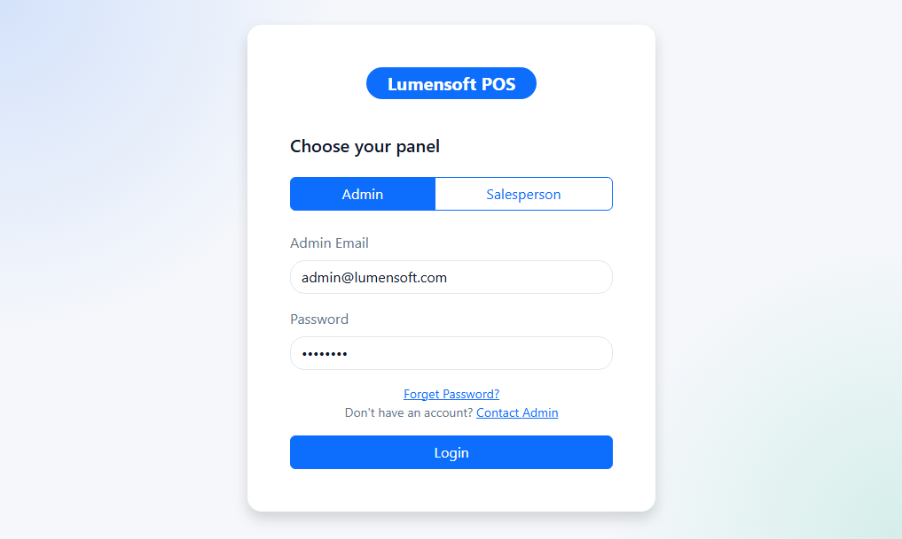
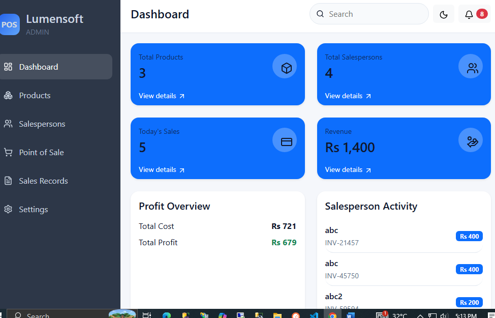
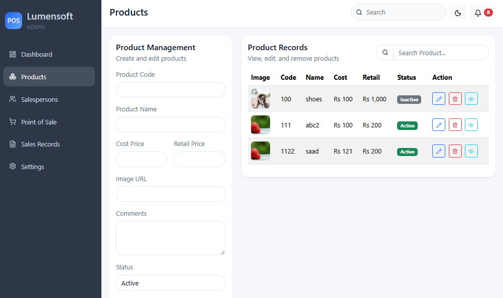
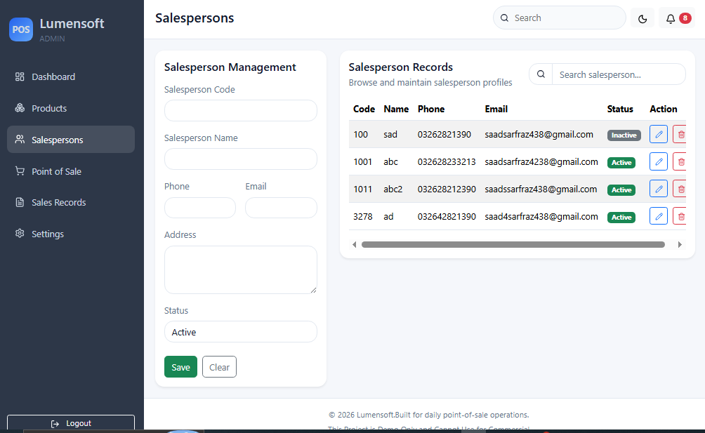
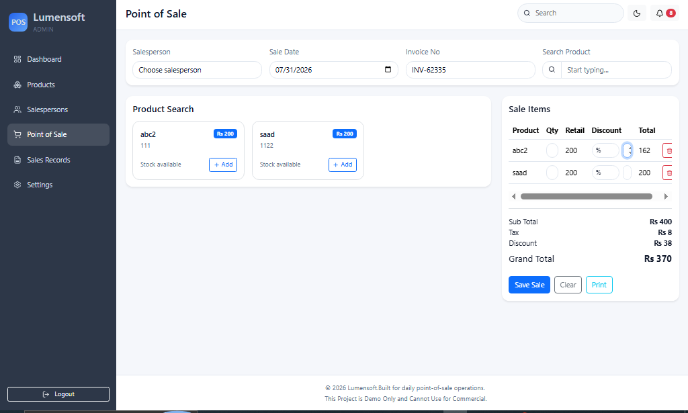
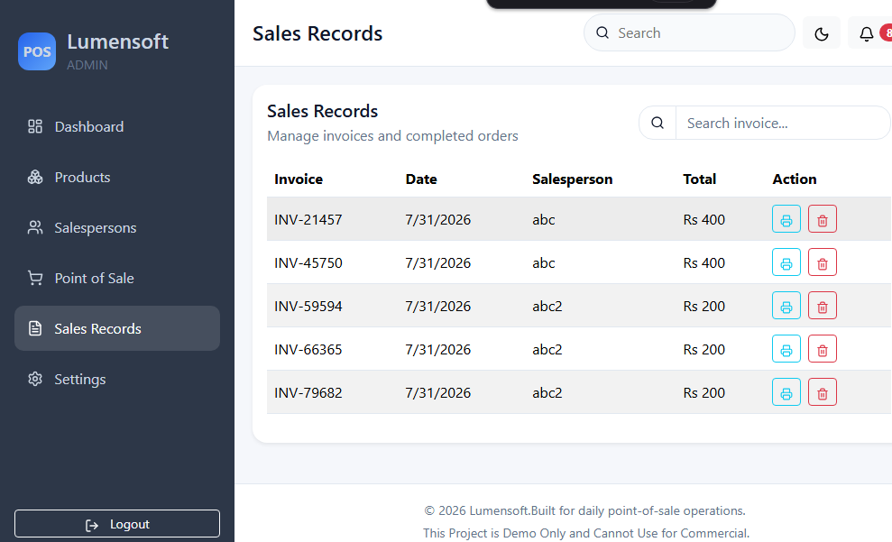
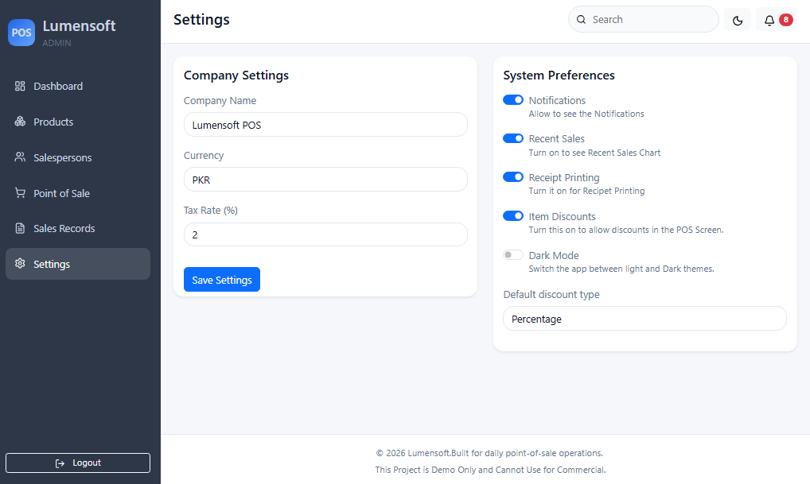
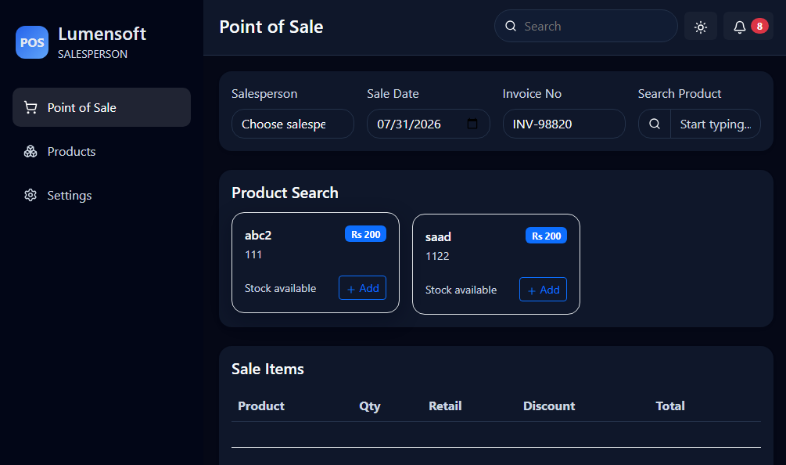
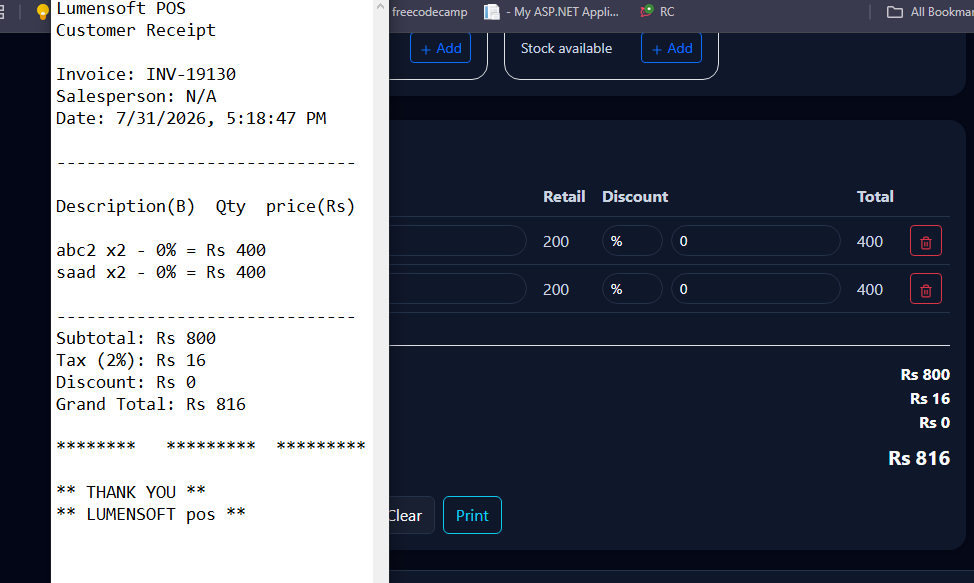

# LumenSoft Point of Sale (POS) System

A modern, fast, and secure Point of Sale (POS) application designed to streamline retail operations. This system automates checkout processes, tracks inventory in real-time, manages salepersons, and generates detailed sales analytics,the application is built using modern web technologies including React.js for the frontend, ASP.NET Core Web API for the backend, and SQL Server for database management.

This workspace is split into two top-level folders:

- [frontend](frontend) contains the Vite React app.
- [backend](backend) contains the ASP.NET Core API project.

---
## Features

- Dashboard with business overview
- Admin and SalesPersons Panels
- Product Management (CRUD)
- Salesperson Management (CRUD)
- Point of Sale (POS)
- Sales Records
- Product Search & AutoComplete
- Generate receipt 
- REST API Integration
- SQL Server Database
- Responsive Bootstrap UI
- Form Validation
- SweetAlert Notifications
- DarkMode function
- Login & Logout feature (Admin and SalesPersons)
  
  ---

## Run It
```
git clone https://github.com/saadsarfraz438
cd POS-System

```

Frontend:

```bash
cd frontend
npm install
npm run dev
```

Backend:

```bash
cd backend/LumensoftPosApi
dotnet run
```

## Step 1: Database Setup (Azure SQL Database)

To move the POS database to Azure, use Azure SQL Database and then update the backend connection string to point to the cloud server.

1. Create a database by searching for **Azure SQL** in the Azure portal and selecting **Create SQL database**.
2. Choose your subscription, create a unique server name, and use **SQL authentication** with an admin username and password.
3. Name the database `pos_db` and select a cost-friendly tier such as **Serverless** or **S0**.
4. In **Networking**, add your current IP address and enable **Allow Azure services and resources to access this server** so the backend can connect.
5. After deployment, replace `LumensoftConnection` in [backend/LumensoftPosApi/appsettings.json](backend/LumensoftPosApi/appsettings.json) with the Azure SQL connection string.

## Notes

The frontend API client points to `http://localhost:5298/api`, matching the backend launch profile in [backend/LumensoftPosApi/Properties/launchSettings.json](backend/LumensoftPosApi/Properties/launchSettings.json).

## Tech Stack

### Frontend
- React.js
- HTML&CSS
- TypeScript
- Bootstrap 5
- React Router
- Axios
- React Hook Form
- SweetAlert2

### Backend
- ASP.NET Core Web API
- C #
- Entity Framework Core
- Repository Pattern
- REST API

### Database
- Microsoft SQL Server


## Project Structure
```
Pos-system/

Frontend/
 src/
├── assets/                  # Static files (images, icons, logos)
├── components/              # Reusable global UI (Button, Modal, Card, Table)
├── features/                # Feature-based modules
│   └── sales/
│       ├── components/      # Sales/POS-specific UI
│       ├── hooks/           # Custom hooks
│       ├── services/        # API calls for sales
│       └── utils/           # Sales helpers
├── hooks/                   # Global custom hooks
├── layouts/                 # App shell and navigation
├── pages/                   # Main views (Dashboard, Products, POS, Settings)
├── routes/                  # Route configuration
├── services/                # Global API setup
├── styles/                  # Global CSS
├── utils/                   # Shared helper functions
├── App.jsx                  # Root component
└── main.jsx                 # Entry point

backend/
└── LumensoftPosApi/
    ├── LumensoftPosApi.csproj          # Dependencies, and target framework (.NET 9)
    ├── Program.cs                      # Application entry point
    ├── Models.cs                       # Data models and Entity Framework entities
    ├── appsettings.json                # Global configuration settings
    ├── appsettings.Development.json    # Development configuration overrides
    ├── Data/
    │   └── LumensoftDbContext.cs       # Entity Framework Core database context mapper
    ├── Properties/
    │   └── launchSettings.json         # Server profiles, ports (HTTP/HTTPS), and IIS configuration
    ├── bin/                            # Compiled machine code
    └── obj/                            # Intermediate build artifacts and NuGet package restoration caches
        ├── LumensoftPosApi.csproj.nuget.dgspec.json
        ├── LumensoftPosApi.csproj.nuget.g.props
        ├── LumensoftPosApi.csproj.nuget.g.targets
        ├── project.assets.json
        └── project.nuget.cache     
```
---
## Functioning:
Login Page for Admin and Salesperson



Admin Dashboard


Product Screen


Salesperson Screen


Point of Sale Screen


SalesRecord Screen


Settings



Salesperson Screen for POS 


Receipt printing option



## Purpose

The purpose of this project is to demonstrate full-stack development skills by implementing CRUD operations, REST API communication, responsive UI design, and SQL database integration in a real-world POS system.

---

Developed as part of the Lumensoft Technologies Evaluation.

---
# React + TypeScript + Vite
## Expanding the Oxlint configuration

```json
{
  "$schema": "./node_modules/oxlint/configuration_schema.json",
  "plugins": ["react", "typescript", "oxc"],
  "options": {
    "typeAware": true
  },
  "rules": {
    "react/rules-of-hooks": "error",
    "react/only-export-components": ["warn", { "allowConstantExport": true }]
  }
}
```
---
## Deployement:
Future Deployment
```
Frontend on Vercel
Backend and Database on Railway
```

## Contributing
Contributions, suggestions, and feature requests are welcome. Feel free to fork the repository, create a new branch, and submit a pull request.

---

## License

This project is licensed under the 

---

### support
- GitHub Issues - Bug reports and feature requests
- GitHub Discussions - Questions and community chat
- Reach out via:
  
[](mailto:saadsarfraz.se@gmail.com)
[](https://www.linkedin.com/in/saad-sarfraz-389450350/)
[](https://x.com/Saadsarfraz438)
